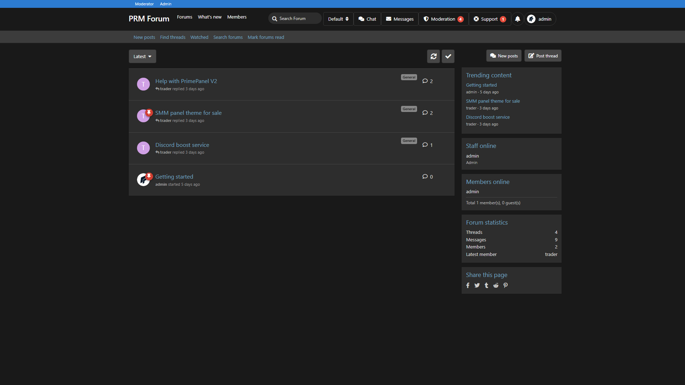
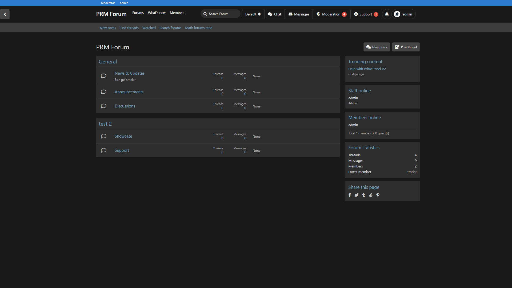
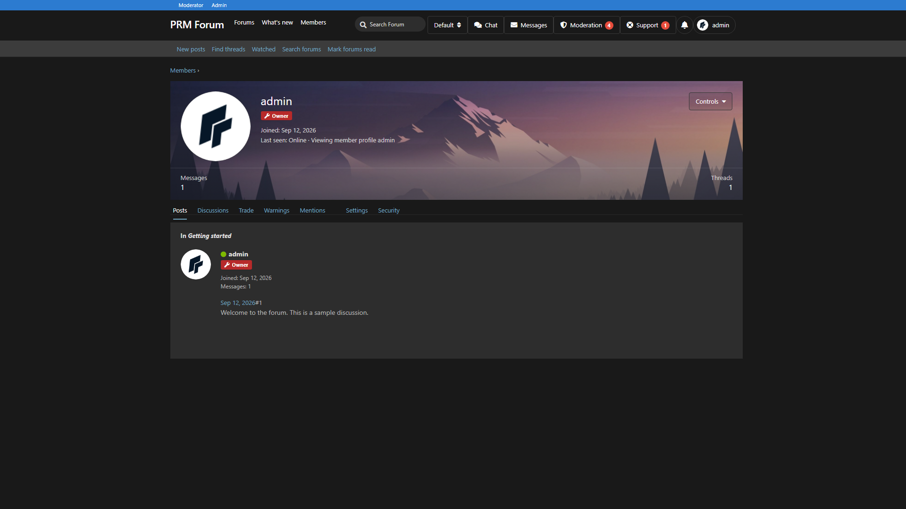
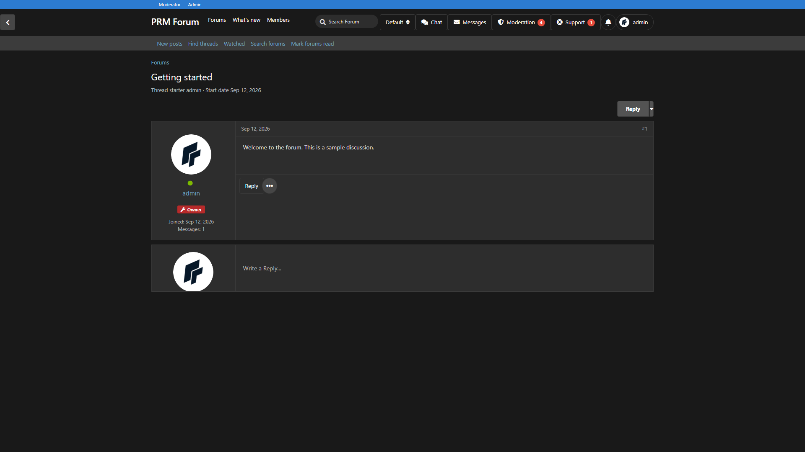

# Sleek Dark XF

XenForo SLEEK-DARK skeleton theme for Flarum: dark chrome, forum list, profile card, and discussion layout.

Compatible with **Flarum 1.8**. Requires **flarum/tags**.

## Screenshots

Homepage:



Tags / forums:



Profile:



Discussion:



## What it does

- Dark XenForo-inspired header, sub-nav, and sidebar widgets
- Tags page rendered as a **forum list**
- Profile header as a user card (avatar, joined, last seen)
- Discussion posts in a two-column XenForo-like layout
- English and Turkish strings included

Works best with **Hero Image**, **Forum Activity**, and **Rank Banner**.

## Install

```bash
composer config repositories.prm-sleek-dark vcs https://github.com/smmpanelscripts1/prm-sleek-dark
composer require prm/sleek-dark:dev-main
```

Enable **Sleek Dark XF**, then:

```bash
php flarum cache:clear
```

Build your forum tree under Admin → **Tags** (parent + child tags).

## License

MIT
